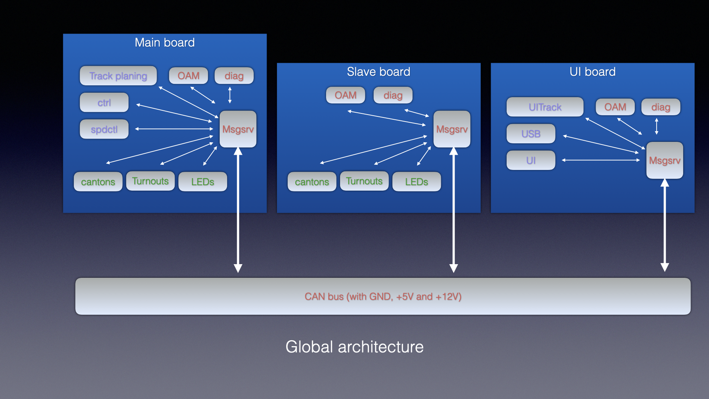

#  trainctl lib

this is main part of the project

code is organized with several ''tasklet''  : functions, implementing a FSM, that shall be call regularly, and
communicate by message only, through a messaging  tasklet.
(This is closed to ITU Z-100 SDL model)

## Features

- automatic train (given origin-destination). _not yet implemented_

- manual ''safe'' train driving : through UI board, each train can be driven manually, but system
ensure safety and stop train before collision or end of track. _implemented but for short train only_

- CTC like visualisation. _impletend, but HTML generation is not performed on target, but on PC host_

- PID controlled speed, using BEMF as speed feedback value ; this is intended to give fine control at low speed. _implemented but BEMF is very noisy, so we only use PI. A predictive control might behave better_

- position estimation on canton (based on BEMF), giving the possibility to define logical subblocks (electrically part of canton, but topologically different). _implemented, relatively reiiable if we define 

- current based presence detection. _implemented but I2C/ina3221 tends to crash_

- turnout control

- control of LED in diorama

- other...

## Global architecture

The system is targeted to be multiboard, one board being master (storing configuration, running trackplan, ctrl, and spdctrl, i.e. tasklet running on a per train basis), and controlling the other slave boards, communicating through **CAN bus**

all messages are 64bits long, and include an 8 bits origin and destination address.

There is no difference between sending a message to a local tasklet and to a remote tasklet : the sending tasklet does not know the physical location of the receiving tasklet.

Only *msgsrv*, messaging service, knows if a message shall be delivered to local tasklet(s) or forwarded to CAN bus (to be delivered to slave board tasklet) or to USB (delivered to Mac software)

Some special addresses allows message to be broadcasted to either :

- all tasklet of the system

- all local board tasklets

- all OaM tasklets on all boards

## RTOS

System uses FreeRTOS. Tasklet are grouped into few RTOS tasks - tasklet structure allows us to move them from a task to another if needed, with very little code impact.

Most of the system runs using polling, trigger by ADC conversion (which itself is tirggered by PWM timer). Main tasklets thus runs in a single task, and are invoked at PWM frequency or divided PWM frequency (typically, they are invoked at 100Hz)

Polling is pretty ok for this, since checking pending messages is a very lightweight operation,  though there is a waste of power when all trains are idle that could be handled

Some processing either need a different frequency (LEDs needs at least 1000Hz, UI and OaM are ok with 10Hz) and/or includes blocking call (OS sleep or busy wait, typically USB, ina3221 on I2C, UI due to ssd1306 library, OaM due to ) and thus runs on separate OS tasks.

We only use FreeRTOS notification mechanism to wake up the tasks

We currently have the following tasks (by decreasing priority, mostly FBS) :

- ledTask (1000 Hz)

- ctrlTask (100Hz, synchronous with PWM), runs most of the tasklet, including msgsrv

- ina3221 current measure (on I2C)

- oscillo (internal instrumentation)

- USB

- OAM

- UI

## Instrumentation

### traces

We use STM32 trace macrocell (ITM), allowing printf-like traces (we do not use printf() itself, because it needs large stacks), through itm_debug_n_() macros

### high frequency oscilloscope
We also have an optional internal "oscilloscope", using ADC2 and recording both internal variables and volt level on ADC during a few ms, which can be triggered either from code or from USB.

Data is sent on USB and displayed using good old gnuplot

### CSV/Graph stats and traces

We also have a global stat  val mechanism (statval.c) which allows continuous reporting of data, and storing and displaying (on Mac) long term (several seconds or minutes) data.

Datas are sent continously on USB, as soon as USB is free (no pending msg)

### RTOS montioring

Not yet implemented (typ. we need to monitor %idle on each PWM pulse and average)
